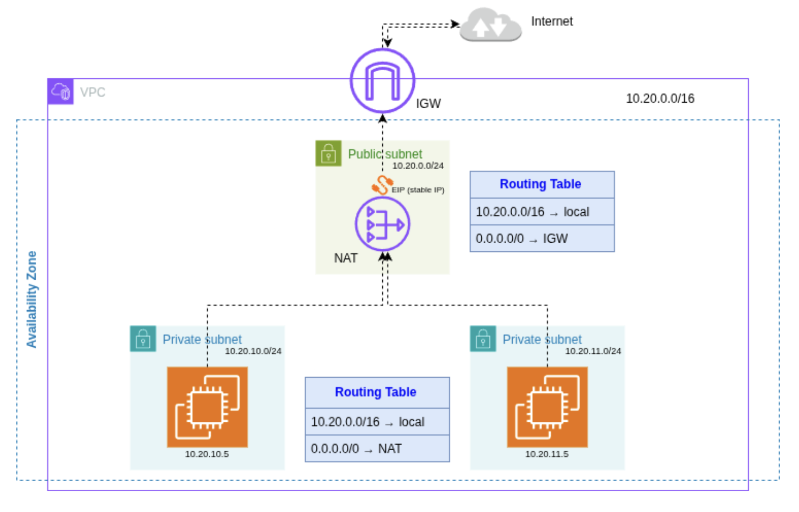

# Altair WorkSpaces Egress Solution

Altair whitelists only specific public IPs. WorkSpaces need a stable, single egress IP. The solution suggested here is to route all WorkSpaces traffic through a NAT Gateway with one Elastic IP.

### Architecture Diagram


The solution implements a **single egress IP architecture** to ensure all AWS WorkSpaces traffic exits through one predictable public IP address that can be whitelisted by Altair.

**Key Components:**

1. **VPC (Virtual Private Cloud)**
   - **Multi-AZ deployment** with private subnets in different Availability Zones
   - Required for AWS WorkSpaces and Directory Service high availability
   - Contains public subnet (single AZ) and private subnets (multiple AZs)

2. **Private Subnets**
   - Host the AWS WorkSpaces instances
   - **No direct internet access** - all outbound traffic must route through NAT Gateway
   - Ensures security by preventing direct exposure to the internet

3. **Public Subnet**
   - Contains the NAT Gateway and Internet Gateway
   - Provides internet connectivity for the entire VPC
   - NAT Gateway is the only component with public internet access

4. **NAT Gateway**
   - **Single point of egress** for all WorkSpaces traffic
   - Provides one static Elastic IP address for all outbound connections
   - Handles all internet-bound traffic from private subnets across all AZs
   - **Deployed in one AZ only** to maintain single EIP requirement

5. **Elastic IP (EIP)**
   - **Static public IP address** assigned to the NAT Gateway
   - **Whitelisted with Altair** for API access
   - Remains constant even if NAT Gateway is recreated

6. **Route Tables**
   - Private subnets route 0.0.0.0/0 (all internet traffic) to NAT Gateway
   - Public subnet routes 0.0.0.0/0 to Internet Gateway
   - Ensures proper traffic flow and security isolation

**Traffic Flow:**
1. WorkSpace user in any AZ initiates internet request
2. Request routes from private subnet to NAT Gateway (cross-AZ routing)
3. NAT Gateway forwards request using its Elastic IP
4. Response returns to NAT Gateway and is forwarded to WorkSpace
5. Altair sees all requests coming from the same whitelisted IP address

**Benefits:**
- **Predictable egress IP** for Altair whitelisting
- **High availability** through multi-AZ deployment
- **Enhanced security** through network isolation
- **Scalable** - multiple WorkSpaces across  2 AZs share single egress point
- **Cost-effective** - single NAT Gateway serves all WorkSpaces

## Architecture
- VPC with single EIP requirement
- Public subnet: NAT Gateway + Internet Gateway
- Private subnets: WorkSpaces instances
- All WorkSpaces egress → NAT Gateway → Internet (via single EIP)

## Prerequisites
- AWS CLI configured with appropriate credentials
- Terraform >= 1.0
- AWSPowerUserAccess (minimum) + WorkSpaces permissions

## AZ Verification
**Important:** Before deployment, verify the Availability Zone (AZ) where AWS WorkSpaces service is supported.

1. Go to the [AWS RAM console](https://us-east-1.console.aws.amazon.com/ram/home?region=us-east-1#home) in the client's AWS account
2. Check the AZs where AWS WorkSpaces service is available
3. Note that AWS WorkSpaces supported AZs are referenced by ID in AWS documentation
4. The code uses AZ names, so you must verify which AZ names correspond to the supported AZ IDs
5. This verification is crucial because AWS assigns different AZ names to different clients to distribute load (e.g., not all clients have use1-az6 <-> "us-east-1a")

**Why this matters:** If you deploy in an unsupported AZ, WorkSpaces creation will fail. Always verify the supported AZs in the specific client account before proceeding with deployment.

## Deployment

### 1. Initialize Terraform
```bash
terraform init
```

### 2. Review Plan
```bash
terraform plan
```

### 3. Deploy Infrastructure
```bash
terraform apply
```
1236
### 4. Note the Elastic IP
```bash
terraform output nat_gateway_eip
```
**Provide this IP to Altair for whitelisting.**

### 5. Create WorkSpaces (Manual)
1. AWS Console → WorkSpaces
2. Launch WorkSpaces
3. Use the subnet IDs from: `terraform output workspaces_subnet_ids`
4. Select both private subnets
5. Create/Select a Directory (e.g; SimpleAD)
6. Choose relevant bundle
7. Deploy

## Testing

### Test 1: Verify WorkSpace Public IP
Test that the WorkSpace is using the correct egress IP address:

**Windows WorkSpace:**
```powershell
# PowerShell
(Invoke-WebRequest -Uri "https://api.ipify.org").Content
```

**Linux WorkSpace:**
```bash
curl https://api.ipify.org
```

Both commands should return the same Elastic IP address that was whitelisted with Altair.

### Test 2: Network Connectivity Test
This test verifies that WorkSpaces can access external resources through the NAT Gateway:

1. **Create a test EC2 instance:**
   - Launch a t2.micro instance in the default VPC
   - Use the following user data script:
   ```bash
   #!/bin/bash
   yum update -y
   yum install -y httpd
   systemctl start httpd
   systemctl enable httpd
   echo "<h1>Test Server for Workspace IP: $(curl -s https://api.ipify.org)</h1>" > /var/www/html/index.html
   ```

2. **Configure security group:**
   - Once the EC2 is created, edit the inbound rules to allow HTTP (port 80) traffic only from your personal IP address
   - This ensures only you can access the test server from your local machine

3. **Test connectivity:**
   - From your personal machine, try to access the EC2's public IP, it should be blocked (as expected)
   - From within AWS WorkSpaces (both Windows and Linux), use curl to test:
   ```bash
   curl http://<EC2_PUBLIC_IP>
   ```
   - This should return the test HTML page, confirming WorkSpaces can reach external resources

4. **Cleanup:**
   - Delete the test EC2 instance
   - Stop and delete the AWS WorkSpaces used for testing

## AWS WorkSpaces Creation Steps

### Overview
For testing, you need to create AWS WorkSpaces (1-2 instances). Each AWS WorkSpace is a Desktop-as-a-Service (DaaS) instance associated with a specific user (email address).

### Key Concepts
- **Personal vs. Pool WorkSpaces**: 
  - Personal WorkSpaces are dedicated to one user (data persists between sessions)
  - Pool WorkSpaces are shared (you may get different workspaces on login, data may not persist)
- **Directory**: Required to store usernames and passwords for WorkSpace users
- **SimpleAD**: Cheapest directory option, supports up to 500 users, free when used in WorkSpaces

### Step-by-Step Creation

#### 1. Create Directory (if needed)
1. Go to AWS Workspace Service console and starting creating a Personal Workspace
2. In step 3, you will be asked to create/select a Directory
3. Create a new AWS managed Directory
2. This will redirect you to reate a new **SimpleAD** directory
3. Configure directory settings (name, password, etc.)
4. Wait for directory creation to complete

#### 2. Create Users
1. Back to the AWS Workspace console, select your SimpleAD directory (now active) to register it to the workspace
2. Select the registered Directory in the AWS Workspace creation form
2. Go to **Users** section
3. Click **Create user**
4. Enter:
   - User name
   - Display name
   - Email address
   - Password
5. Repeat for each user needed

#### 3. Create WorkSpaces
1. Select (checkbox) the users you want to create WorkSpaces for (max 5 per batch) => !!each checked checkbox = a separate workspace created!!!
2. Verify bundle(s) are relevant (cheapest/free tier eligible for testing)
6. Select the private subnets from: `terraform output workspaces_subnet_ids`
7. Review configuration then click **Launch WorkSpaces**

#### 4. User Management in SimpleAD Directory
**Adding Users:**
- Always done through WorkSpaces creation process 

**Updating User Information:**
- **Email/Name**: Update through WorkSpace details interface
- **Password**: Two options:
  1. User clicks "Forgot password?" on WorkSpaces login screen
  2. Admin resets via Directory Service console → Actions → Reset user password

**Deleting Users:**
- Not typically needed (SimpleAD supports 500 users)
- Can update email addresses when needed
- Directory remains free as long as users are active in WorkSpaces

### Cost Considerations
- **SimpleAD**: Free when used in WorkSpaces, $36/month if unused for 30+ days
- **WorkSpaces**: Hourly billing in AutoStop mode
- **Cost threshold**: After 80 hours/month, switches to monthly billing (more cost-effective)
- **Billing reset**: Resets each calendar month (not AWS billing cycle)

## Cost Estimation

### Infrastructure Costs (Excluding WorkSpaces)
The monthly cost for this solution, excluding AWS WorkSpaces (which depends on usage), is approximately **$36-$42** and includes:

1. **Zonal NAT Gateway**: ~$36/month (when deployed in one AZ)
2. **Cross-zone Data Transfer**: ~$6/month (for traffic between AZs)

**Note:** All other networking resources (VPC, subnets, route tables, Internet Gateway) are free of charge.

### Total Solution Cost
- **Infrastructure**: $36-$42/month
- **WorkSpaces**: Variable based on usage (hourly or monthly billing)
- **SimpleAD**: Free when used with WorkSpaces

### Cost Optimization Tips
- Use AutoStop mode for WorkSpaces to minimize compute costs
- Monitor NAT Gateway data transfer to optimize cross-zone traffic
- Consider using the monthly billing option for WorkSpaces if usage exceeds 80 hours/month

### 6. Cleanup (Important for cost management!)
```bash
# Delete WorkSpaces and Directory from console first!!!
# Then destroy Terraform resources:
terraform destroy
```
